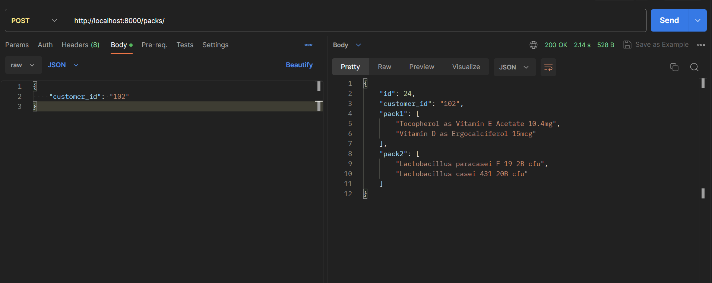
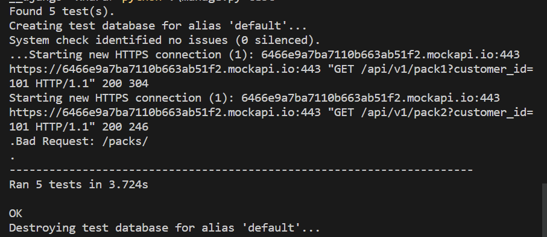

# Django API - Task xNara
Create a Django API project that exposes an endpoint to pull data from another API endpoint to
map and respond with the combined data.

# Project development plan

| Section | Overview | Actionable Steps |
| --- | --- | --- |
| Initialization | Set up the base Django project. | 1\. Create new Django project.  2. Navigate to project directory.  3. Start a new Django app. |
| Package Installation | Install necessary libraries. | 1\. Install Django Rest Framework, Swagger for DRF, and `requests`. |
| App Configuration | Add necessary configurations for app. | 1\. Update `INSTALLED_APPS` in `settings.py`.  2. Add necessary configurations for `REST_FRAMEWORK`. |
| Model Development | Create models for logging customer ID and errors. | 1\. Define the logging model `CustomerLog`. |
| API Development | Develop the main API functionality. | 1\. Define serializer for input payload.  2. Create viewset for API that fetches pack data, combines it and logs any errors. |
| Swagger Integration | Set up Swagger for API documentation. | 1\. Configure Swagger/OpenAPI in `urls.py`.  2. Add path for Swagger UI. |
| Exception & Logging | Ensure robust error handling and logging. | 1\. Directly log customer ID and errors in the view method. |
| Testing & Review | Test API and review for any issues. | 1\. Review code structure and logic.  2. Run database migrations.  3. Start the server and test API using Postman/Swagger. |

# Sample API Response

# Task Details

### Overview:

The given project is a simple Django API system that logs customer requests with potential errors. The main functionality is to make requests to an external API (possibly a packaging system) and retrieve and format data based on the customer ID.

* * * * *

### views.py

What:

-   Defines the `PackDataViewSet` which is a RESTful API endpoint to handle CRUD operations.
-   Includes two helper functions: `get_traceback_in_json` to capture exceptions and `make_customer_log` to log errors.

Why:

-   To handle requests where the system attempts to fetch packaging data from an external system using the customer ID.
-   Log any potential errors or discrepancies to the `CustomerLog` model and also in console.

Improvements and TODOs:

1. We Separate the business logic from the API layer, which can aid in modularization and improve testing.

* * * * *

### models.py

What:

-   Defines a model `CustomerLog` that holds customer_id, request timestamp, and any potential error messages.

Why:

-   To track and log every request made by a customer to the system and to record any associated errors.

* * * * *

### serializers.py

What:

-   Contains the `CustomerPayloadSerializer` which ensures that a `customer_id` is provided in the incoming request.

Why:

-   To validate the incoming request data before processing.

* * * * *

### settings.py

What:

-   Contains Django project settings, including database setup, installed apps, middleware, logging, and rest framework configuration.

Why:

-   To configure the Django project and its various components.

Improvements and TODOs:

1.  For production readiness, sensitive data such as `SECRET_KEY` should be kept out of version control using tools like environment variables or secret management services (which I did to a certain extent).
2.  The project is using SQLite as the database. For more robust applications, we can consider switching to more scalable databases like PostgreSQL.
3. We can Consider adding more sophisticated logging strategies for production, such as file-based logging with log rotation.
4. As we are making similar api calls to external server, we can thing of introducing Caching using any of the services (either one provided by DRF or we can use and setup redis in production)

* * * * *

### admin.py

What:

-   Registers the `CustomerLog` model with Django Admin with some customization on display fields, filters, and search.

Why:

-   To provide an admin interface where one can view, edit, and manage logged customer data.

* * * * *

### project/urls.py

What:

-   Main URL configurations of the project. It includes routes for the core app and the Django admin. Additionally, it provides a route for the Swagger API documentation.

Why:

-   To route HTTP requests to their respective view functions or classes.

* * * * *

### app/urls.py

What:

-   URL configurations for the core app. Utilizes `DefaultRouter` to auto-generate CRUD routes for `PackDataViewSet`.

Why:

-   To define and manage routes specific to the core app.

Improvements and TODOs:

1.  As the system grows, we can consider adding versioning to the API for backward compatibility.

* * * * *

### PS:

-   I have used `drf_yasg` to provide Swagger documentation, which is excellent for API testing and collaboration.
-   I have used `python-decouple` is used for environment variable management, which is a good practice to keep configurations out of the codebase.

* * * * *

# Testing

For testing I have written some basic test cases that should be must in order to test this project. This includes testing three basic things:
1. testing `models.py`
2. testing `views.py`
3. testing `serializers.py`

All the test cases can be found in `core/tests.py`.

### Test Results
